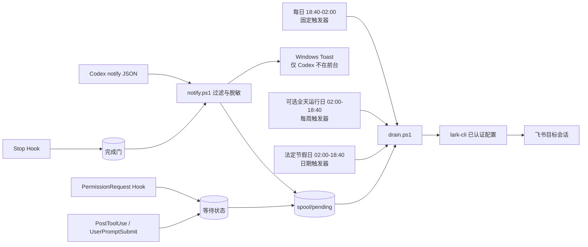

# Codex Feishu Notify for Windows

[](https://github.com/xp90211-pixel/codex-feishu-notify-windows/releases/latest)
[](https://github.com/xp90211-pixel/codex-feishu-notify-windows/actions/workflows/powershell.yml)
[](#前置条件)
[](LICENSE)

一个面向 Windows 的 Codex 通知桥接与图形化管理工具：捕捉真实的任务完成和等待授权事件，通过本地已认证的 `lark-cli` 发送到飞书，同时提供独立的 Windows Toast、运行计划、节假日和手动启停控制。

适合 Codex 只能运行在某台固定 PC、远程重连延迟较高，希望从飞书查看任务进度的场景。

> [!IMPORTANT]
> 设置器中的“PC 通知”是本项目生成的 Windows Toast，Windows 可能把发送方显示为“Windows PowerShell”；它不是 Codex 桌面端自带通知。PC Toast、飞书通知和 Codex 自带通知是三套相互独立的状态。

> [!NOTE]
> 当前项目只做本机到飞书的单向通知，不从飞书执行审批、按钮回调、终端输入或任意远程命令；相关取舍见[远程审批与终端输入评估](docs/remote-control-evaluation.md)。

这是一个非官方社区项目，与 OpenAI、飞书或 Lark 均无隶属关系。当前仅支持 Windows 10/11 与已认证的 `lark-cli` 配置。

## 当前稳定版

| 版本 | 推荐下载 | 校验文件 | 便携包 |
|---|---|---|---|
| [`v0.6.0`](https://github.com/xp90211-pixel/codex-feishu-notify-windows/releases/tag/v0.6.0) | [`setup.exe`](https://github.com/xp90211-pixel/codex-feishu-notify-windows/releases/download/v0.6.0/codex-feishu-notify-windows-v0.6.0-setup.exe) | [`setup.exe.sha256`](https://github.com/xp90211-pixel/codex-feishu-notify-windows/releases/download/v0.6.0/codex-feishu-notify-windows-v0.6.0-setup.exe.sha256) | [`ZIP`](https://github.com/xp90211-pixel/codex-feishu-notify-windows/releases/download/v0.6.0/codex-feishu-notify-windows-v0.6.0.zip) |

后续版本请以 [Releases / Latest](https://github.com/xp90211-pixel/codex-feishu-notify-windows/releases/latest) 为准。Release 同时提供 setup EXE、便携 ZIP 和各自的 SHA-256 文件。

## 快速开始

1. 确认满足[前置条件](#前置条件)，尤其是已有可用的 `lark-cli` profile 和目标飞书会话 ID。
2. 从上表下载 setup EXE 与对应 `.sha256`，核对哈希后双击运行。
3. 在自动打开的图形设置器中检查连接与计划，点击“安装通知”并确认。
4. 重新打开 Codex，在 Hook 管理界面审查、信任并启用新安装或变化的 Hook。

详细过程、安全边界和 SmartScreen 说明见[一键安装](#一键安装推荐)。

## 界面预览

以下为 v0.5 界面参考图；v0.6 新增首页状态摘要、独立“保存设置”和需确认的“发送测试通知”。


## 解决什么问题

- 只接收 `agent-turn-complete`，过滤标题生成、活动摘要等内部回合。
- 可仅通知已登记在 Codex 桌面的任务：解析已知 JSON 字段；明确为 false 或不认识的结构不会放行。这是过滤规则，不是身份授权。
- 飞书通知采用“始终”语义，不跟随 PC 的“仅 Codex 不在前台时通知”。
- 运行计划与飞书投递设为两个独立手动开关：停用计划不改飞书配置，关闭飞书也不关闭 PC 通知。
- PC 端使用隐藏的 Windows Toast；默认只在 Codex 不处于前台时显示，不弹出命令行窗口。
- 使用官方 `SessionStart`、`PermissionRequest`、`PostToolUse`、`UserPromptSubmit` 和 `Stop` 生命周期 Hook：等待授权可提醒并在恢复后撤销，新会话的完成通知须经过两阶段门。
- 通知钩子只进行本地原子入队，不直接联网，也绝不启动计划任务。
- 计划任务是真正的每日触发器，默认仅在 18:40 至次日 02:00 每分钟排空队列。
- 法定节假日自动补齐 02:00 至 18:40 的缺口；还可任选周一至周日作为固定“全天运行日”，未选择的普通周末不自动放宽。
- 通过事件哈希、已发送标记和 `lark-cli` 幂等键降低重复发送风险。
- 默认发送飞书卡片；仅在退出码为 0、返回 `code: 0` 且含 `data.message_id` 时确认成功。空白、非 JSON、未知回包或超时都保留队列，有限重试使用相同幂等键。
- 新安装默认不发送任务/结果摘要；开启预览后进行 JSON 键和值的脱敏，但无法保证识别所有业务敏感内容。
- 状态锁协调开关与下一次发送，排空锁防止多进程重复投递；CLI 调用默认 30 秒超时。
- 安装前解析完整 TOML、校验触发器；安装中途失败自动恢复配置、运行文件和计划任务。
- 日志轮转、过期状态与 suppressed 队列清理；发布包按逐文件白名单打包并扫描实际 ZIP。

OpenAI 官方配置参考说明，用户级 `~/.codex/config.toml` 的 `notify` 是一个字符串数组命令，并会收到 Codex 传入的 JSON 载荷；项目级配置不能覆盖该通知项：[Configuration Reference](https://developers.openai.com/codex/config-reference/)。生命周期事件及输入/输出边界见 [Hooks guide](https://developers.openai.com/codex/hooks)。

## 工作方式



`notify.ps1` 在时间窗外仍可入队；普通日的队列项会等到下一次计划投递。日历中的法定节假日由日期触发器补齐日间缺口；用户勾选的固定星期由每周触发器补齐同一缺口，因此这些日期全天每分钟检查队列。超过 `max_queue_age_hours` 的项目会进入 `spool/expired`，不会继续发送。

安装前已经打开的 Codex 会话没有 `SessionStart` 就绪标记，会暂时沿用原完成通知；重新开启 Codex 后，新会话自动进入严格两阶段完成门。

## 前置条件

- Windows 10/11。
- Codex 支持用户级 `notify` 与生命周期 Hooks；新安装后需重新开启 Codex 才能完整加载 Hook。
- PowerShell 7 优先；缺失时安装器回退到 Windows PowerShell。
- `lark-cli` 已安装，并准备好可代表机器人发送消息的本地配置。
- 已知目标会话 ID，例如 `oc_xxx`。不要把真实 ID 提交到 Git。

传输使用 `im +messages-send --format json`。支持原生 `lark-cli.exe`，也会把官方 npm 包的 `.cmd` / `.ps1` 包装器解析到其附带的原生 EXE，避免 `cmd.exe` 损坏中文、引号和反斜杠。不支持任意自定义 shell 包装器；请明确指定 EXE。新 CLI 版本应先运行诊断，再由你点击“发送测试通知”确认真实连接。`DryRun` 仅检查本地队列，不验证服务端登录。

### 前置：安装飞书连接器与准备 lark-cli

如果还没有可用的飞书连接器或 `lark-cli` 配置，可以参考第三方项目 [zarazhangrui/lark-coding-agent-bridge](https://github.com/zarazhangrui/lark-coding-agent-bridge) 的[中文安装说明](https://github.com/zarazhangrui/lark-coding-agent-bridge/blob/main/README.zh.md)。它用于把飞书 / Lark 与本地 Codex CLI 等编程助手连接起来，支持 Windows 后台任务、独立 profile 和默认仅创建者可用的访问控制。

该连接器与本项目相互独立，并由各自作者维护。它的安装过程可能涉及扫码授权、创建飞书 PersonalAgent 应用和修改访问范围；建议把下面这段完整提示词直接复制给 Codex（ChatGPT），让它按对方最新 README 检查环境并协助安装：

```text
请参考下面的 README，帮我安装并配置 lark-channel-bridge，并告诉我怎么使用。请先检查我的环境是否满足前提条件；涉及授权、扫码、创建飞书应用或开放他人访问时，必须先征得我确认；默认只允许我自己使用，不要开放给群成员或其他同事。README：https://github.com/zarazhangrui/lark-coding-agent-bridge/blob/main/README.zh.md
```

连接器配置完成后，再回到本项目确认：系统能自动找到 `lark-cli`（或在图形设置器中指定路径）、已选择正确的本地 profile（推荐为 Codex 使用独立 profile），并已取得接收通知的目标会话 ID。不要把 App Secret、profile 配置或真实会话 ID 提交到仓库。

## 一键安装（推荐）

1. 先完成上面的飞书连接器、`lark-cli` profile 和目标会话 ID 准备。
2. 从 [v0.6.0 Release](https://github.com/xp90211-pixel/codex-feishu-notify-windows/releases/tag/v0.6.0) 下载 `codex-feishu-notify-windows-v0.6.0-setup.exe` 和同名 `.sha256` 文件；更新版本请改用 [Latest Release](https://github.com/xp90211-pixel/codex-feishu-notify-windows/releases/latest) 中对应的两个文件。
3. 在 PowerShell 中核对安装器哈希：

   ```powershell
   (Get-FileHash .\codex-feishu-notify-windows-v0.6.0-setup.exe -Algorithm SHA256).Hash
   Get-Content .\codex-feishu-notify-windows-v0.6.0-setup.exe.sha256
   ```

4. 两边哈希一致后双击安装器。它不要求管理员权限，会把管理程序安装到 `%LOCALAPPDATA%\Programs\CodexFeishuNotify\v0.6.0`，创建开始菜单快捷方式并自动打开“Codex 飞书通知设置”。
5. 在图形设置器中填写飞书会话 ID，核对自动找到的 `lark-cli` 与 profile，设置运行计划，然后点击“安装通知”并确认变更。
6. 安装完成后重新打开 Codex，在 Hook 管理界面审查、信任并启用本项目安装或更新的 Hook。

这个 EXE 是“一键打开安装向导”，不会静默创建飞书应用、代替用户扫码授权、开放其他用户访问、写入真实会话 ID，或绕过 Codex 的 Hook 信任步骤。重复运行同一版本会安全替换该版本的管理程序文件，不会直接覆盖已经生效的私有通知配置。

当前 Release 安装器尚未使用商业代码签名证书，Windows SmartScreen 可能显示“未知发布者”。只有在下载地址确认为本仓库且 SHA-256 与 Release 附件一致时才应继续；不愿运行未签名 EXE 时，请改用下方命令行安装或 Release ZIP。

一键安装包含两个明确分开的阶段：

| 阶段 | 实际操作 | 是否改动 Codex / 飞书配置 |
|---|---|---|
| 双击 setup EXE | 安装版本化的管理程序、创建开始菜单快捷方式、打开设置器 | 否 |
| 点击“安装通知”并确认 | 备份并部署运行脚本、合并 Codex 配置与 Hook、注册计划任务 | 是 |

## 命令行安装

在 PowerShell 中执行：

```powershell
git clone https://github.com/xp90211-pixel/codex-feishu-notify-windows.git
Set-Location .\codex-feishu-notify-windows

pwsh -File .\tests\Test-Project.ps1

pwsh -File .\scripts\Install.ps1 `
  -ChatId 'oc_REPLACE_WITH_YOURS' `
  -TaskName 'Codex.LarkNotify.codex' `
  -LarkChannelProfile 'codex' `
  -ScheduleStart '18:40' `
  -ScheduleEnd '02:00' `
  -HolidayRegion 'Auto'

pwsh -File .\scripts\Test-Configuration.ps1 -TaskName 'Codex.LarkNotify.codex'
```

安装器会：

1. 复制运行文件到 `%USERPROFILE%\.codex\integrations\codex-feishu-notify`；
2. 在该目录写入被 Git 忽略的 `settings.local.json`；
3. 备份并安全更新用户级 `.codex\config.toml`；
4. 合并并备份用户级 `.codex\hooks.json`，保留其中不属于本项目的 Hook；
5. 尝试保留或串联已有 `notify` 命令，并保存升级前运行文件快照；
6. 按 `-TaskName` 注册隐藏计划任务（推荐 `Codex.LarkNotify.codex`）：一个每日时间窗触发器、可选的每周全天运行触发器，以及未来法定节假日的日期触发器；
7. 禁止按需启动，并且安装时不会手动启动任务。

图形设置器在全新电脑上默认使用 `Codex.LarkNotify.codex`。命令行首次安装未传 `-TaskName` 时仍默认 `Codex.FeishuNotify`；已有安装的升级、诊断与卸载会优先从 `install-state.json` 推断任务名。显式传入卸载任务名必须与安装记录一致，且动作必须属于该安装。

`-HolidayRegion Auto` 根据 Windows“国家或地区”自动选择：新加坡使用 `SG`，中国使用 `CN`，无法识别时关闭节假日扩展。也可明确指定：

```powershell
# 新加坡法定节假日；项目内置 2026-2027 日历
pwsh -File .\scripts\Install.ps1 -ChatId 'oc_REPLACE_WITH_YOURS' `
  -TaskName 'Codex.LarkNotify.codex' -HolidayRegion SG

# 中国法定节假日；项目内置 2026 日历
pwsh -File .\scripts\Install.ps1 -ChatId 'oc_REPLACE_WITH_YOURS' `
  -TaskName 'Codex.LarkNotify.codex' -HolidayRegion CN

# 不启用节假日全天运行
pwsh -File .\scripts\Install.ps1 -ChatId 'oc_REPLACE_WITH_YOURS' `
  -TaskName 'Codex.LarkNotify.codex' -HolidayRegion None

# 使用自行审核的本地日历
pwsh -File .\scripts\Install.ps1 -ChatId 'oc_REPLACE_WITH_YOURS' `
  -TaskName 'Codex.LarkNotify.codex' `
  -HolidayCalendarPath '.\my-holidays.json'

# 每周六、周日全天运行；可与任一节假日模式叠加
pwsh -File .\scripts\Install.ps1 -ChatId 'oc_REPLACE_WITH_YOURS' `
  -TaskName 'Codex.LarkNotify.codex' `
  -HolidayRegion SG -AllDayWeekdays Saturday,Sunday
```

新加坡日历依据人力部公布的 [2026 年公共假日](https://www.mom.gov.sg/newsroom/press-releases/2025/0616-public-holidays-for-2026) 和 [2027 年公共假日](https://www.mom.gov.sg/newsroom/press-releases/2026/0618-public-holidays-for-2027)，包括依法顺延的周一假日。中国日历依据 [国务院办公厅 2026 年放假安排](https://www.gov.cn/zhengce/zhengceku/202511/content_7047091.htm)。周六、周日只有在日历中明确列为放假日，或通过 `-AllDayWeekdays` 明确选中时才全天运行。

安装、诊断和卸载共用 TOML 解析器，支持多行数组、单引号字符串和行内注释；`notify` 必须位于根级。无法解析完整配置时会停止且不覆盖。`-ReplaceUnparseableNotify` 只允许替换有效 TOML 中不支持的完整 notify 值，不绕过损坏的 TOML 校验。

## 图形设置器

Windows 上可直接双击项目根目录的 `Open-Settings.cmd`，也可以在 PowerShell 中运行：

```powershell
powershell.exe -NoLogo -NoProfile -STA -ExecutionPolicy Bypass `
  -File .\scripts\Settings-Gui.ps1
```

设置器会优先识别现有的 `Codex.LarkNotify.codex`，其次识别兼容的 `Codex.FeishuNotify`，并从计划任务动作自动确定安装目录；全新电脑上未找到任何兼容任务时，“安装通知”默认创建 `Codex.LarkNotify.codex`。它支持：

- 使用单一“运行计划：已开启/已关闭”开关立即启停并保存计划任务状态；使用单一“飞书通知：已开启/已关闭”开关立即保存通知状态；
- 使用动态“马上开始 / 立刻停止”按钮临时覆盖当前时段：非运行时段可立即运行到正常时段接管，运行中可暂停到下个运行时段；长期计划不会被改写；
- 显示当前配置的完整读取路径；`lark-cli` 路径留空时显示自动查找提示和当前机器实际解析到的程序路径；
- 从配置根目录自动枚举已有 Lark profile；“使用独立 Lark profile（推荐）”取消后会禁用该下拉列表并改用 `lark-cli` 默认认证；
- 在独立的“运行计划”页调整每日开始时间、结束时间、检查间隔和队列保留时间；
- 选择新加坡、中国、关闭、自动识别或自定义节假日日历，并查看当前模式的实际运行说明；
- 从周一至周日中任选固定“全天运行日”，与节假日日历叠加；
- 调整“仅通知已登记在 Codex 桌面端的任务（推荐）”、飞书桥接回声过滤和任务/结果摘要；
- 调整严格完成门、等待授权通知、飞书卡片/文本格式、发送重试与 PC 通知规则；
- 关闭 PC 通知总开关时，自动禁用其前台条件、任务完成和等待授权子选项，并保留原勾选值；
- 检查配置、查看任务状态、打开日志，以及启用或停用任务；
- 查看生命周期 Hook、等待状态和完成门计数，并可在“飞书连接”页底部使用“安装通知”首次部署或修复当前用户的通知集成，或执行受保护的“卸载通知”；
- 使用“飞书连接 / 运行计划 / 通知规则 / 状态与检查结果”分页；窗口可缩放，较小屏幕或高 DPI 下内容自动滚动，底部操作区保持可访问；
- 从旧版 `drain.ps1` 导入已有私有参数，首次应用时迁移为受管的 `settings.local.json`。

### 几个容易混淆的开关

| 控件 | 实际作用 | 不会影响 |
|---|---|---|
| `运行计划：已开启 / 已关闭` | 立即启用或停用持久化的计划任务状态 | 不改每日时间窗，也不关闭飞书投递配置 |
| `马上开始 / 立刻停止` | 临时强制运行或暂停；到下个正常时段边界后由原计划接管 | 不改已保存的每日时间窗，不调用计划任务的按需启动 |
| `飞书通知：已开启 / 已关闭` | 控制本项目是否把新事件送入飞书队列 | 不会关闭飞书 App，也不关闭本项目的 PC Toast |
| `PC 通知` | 控制本项目生成的 Windows Toast；关闭后子选项自动不可选但保留原值 | 不控制 Codex 桌面端自带通知，也不影响飞书发送 |

关闭飞书通知后，新事件不进入飞书队列，已有待发项移入可恢复的 `spool/suppressed`；再次开启时不会自动补发这些旧项目。PC Toast 与飞书发送保持独立。

### 保存、安装与安全确认

启动设置器只读取配置。两个入口各司其职：

- “保存设置”：只更新私有设置；仅时间规则或计划启用状态变化时重建任务，不部署脚本、不改写 Codex Hook，无需重新信任。旧运行时请先升级到 v0.6。
- “安装通知”：首次部署、升级或修复；备份并部署运行文件、合并 Hook、更新根级 notify 和计划任务。完成后重新打开 Codex，审查并信任变化的 Hook。
- “发送测试通知”：确认后才向**已保存配置**指定的会话发送一条固定测试文本，不含任务内容；仍遵循通知总开关和运行时段。
- 首页说明当前为何未投递；状态页显示下一次允许发送、最近实际发送时间、飞书 message ID 和有效状态计数。

改变时间规则、安装/修复、卸载或关闭计划时会清除临时覆盖；只保存通知内容选项不会取消临时覆盖。关闭后不会再提交新的发送，但已经交给飞书服务的在途请求无法撤回。飞书会话 ID 默认遮挡。

命令行安装时也可预设关闭状态：`-DisableScheduledTask` 停用运行计划，`-NoFeishuNotifications` 关闭飞书投递。两个参数都不会按需运行计划任务。

维护者可使用只读模式验证自动识别和输入模型，不打开窗口：

```powershell
pwsh -NoProfile -File .\scripts\Settings-Gui.ps1 -ValidateOnly
```

## 升级

1. 从 [Latest Release](https://github.com/xp90211-pixel/codex-feishu-notify-windows/releases/latest) 下载新版本 setup EXE 和对应 `.sha256`，核对哈希后运行。
2. 新版管理程序会安装到新的版本目录，并让开始菜单快捷方式指向新版；它会自动识别现有的 `Codex.LarkNotify.codex` 或兼容的 `Codex.FeishuNotify`。
3. 在新版设置器中检查现有配置，然后点击“安装通知”执行升级或修复。只运行 setup EXE、没有点击“安装通知”，不会替换当前正在生效的通知运行脚本。
4. 安装器会备份现有私有配置、Hook 和运行文件。完成后重新打开 Codex，并重新审查发生变化的 Hook。
5. 确认新版正常工作后，才可删除 `%LOCALAPPDATA%\Programs\CodexFeishuNotify` 下不再使用的旧版本管理目录。

## 重要配置

安装后的私有配置位于：

```text
%USERPROFILE%\.codex\integrations\codex-feishu-notify\settings.local.json
```

设置 `CODEX_HOME` 时，配置、Hook、桌面登记状态和默认安装目录均改用该目录；未设置时使用上述默认位置。不要把别人的绝对路径直接复制到新电脑。

主要字段：

| 字段 | 默认值 | 含义 |
|---|---:|---|
| `transport.enabled` | `true` | 飞书通知总开关；关闭时不影响 PC 通知 |
| `transport.chat_id` | 必填 | 飞书目标会话 ID，不提交 Git |
| `transport.cli_path` | 空 | 留空时自动查找 `lark-cli` |
| `transport.channel_home` | `%USERPROFILE%\.lark-channel` | 本地 Lark channel 配置根目录 |
| `transport.profile` | `codex` | 专用配置名 |
| `transport.send_attempts_per_run` | `2` | 每次计划排空中的有限发送尝试次数 |
| `transport.retry_delay_seconds` | `2` | 同一轮尝试之间的等待秒数 |
| `transport.timeout_seconds` | `30` | 单次 CLI 超时秒数，范围 1–120 |
| `delivery.enabled` | `true` | 持久化运行计划总开关，直接运行 drain 也不能绕过 |
| `delivery.suppressed_item_retention_days` | `7` | 已抑制队列保留天数 |
| `filters.visible_threads_only` | `true` | 只保留桌面可见任务；不兼容时可关闭 |
| `filters.skip_bridge_origin` | `true` | 跳过由飞书桥接发起的回合，避免回声 |
| `delivery.start` / `end` | `18:40` / `02:00` | 每日跨午夜运行窗 |
| `delivery.interval_minutes` | `1` | 窗口内排队检查间隔 |
| `delivery.holiday_region` | `SG` | `SG`、`CN` 或 `None`；安装时 `Auto` 会解析为具体值 |
| `delivery.holiday_calendar` | `holidays.local.json` | 安装器复制的私有运行日历 |
| `delivery.all_day_weekdays` | `[]` | 可选 `Monday` 至 `Sunday`；选中的星期补齐为全天运行 |
| `delivery.max_queue_age_hours` | `24` | 过期队列项不再发送 |
| `lifecycle.strict_completion_gate` | `true` | `Stop` 先登记，同一任务的官方完成事件才能入队 |
| `lifecycle.notify_permission_requests` | `true` | 接收真正的权限等待事件 |
| `desktop.enabled` | `true` | 本项目 Windows Toast 总开关；不控制 Codex 自带通知或飞书发送 |
| `desktop.only_when_codex_background` | `true` | 仅控制 PC Toast；不影响飞书发送 |
| `message.format` | `card` | `card` 或 `text` |
| `message.include_*_preview` | `false` | 新安装不发送任务/结果摘要；须明确开启 |
| `message.include_permission_tool` | `false` | 默认不把等待授权的工具名发到飞书 |

修改时间窗、节假日日历或全天运行日后使用“保存设置”或 `Install.ps1 -SettingsOnly`，使任务与配置同步，不能只改 JSON。官方下一年度日历发布后也应更新日历并重新安装；安装器只为日历中尚未过去的日期创建触发器。

安装时可用 `-AllThreads` 关闭“仅桌面可见任务”过滤，用 `-IncludeBridgeOrigin` 保留飞书来源回合，用 `-IncludeTaskPreview` / `-IncludeResultPreview` 明确开启摘要，或 `-NoTaskPreview` / `-NoResultPreview` 关闭。升级遵循“默认值 → 已有配置 → 显式参数”，保留未指定选项与扩展字段；已有预览为 true 的安装不会被擅自改为 false。清空既有全天运行日使用 `-ClearAllDayWeekdays`。

## 验证与排错

只读诊断：

```powershell
pwsh -File .\scripts\Test-Configuration.ps1 -TaskName 'Codex.LarkNotify.codex'
```

如果沿用旧任务 `Codex.FeishuNotify`，请把以上 `-TaskName` 改为实际名称。图形设置器的“状态与检查结果”页会自动使用当前识别到的任务名。

查看最近的脱敏日志：

```powershell
Get-Content "$env:USERPROFILE\.codex\integrations\codex-feishu-notify\logs\notify.jsonl" -Tail 30
```

直接测试排空逻辑但不真正发消息：

```powershell
pwsh -File "$env:USERPROFILE\.codex\integrations\codex-feishu-notify\drain.ps1" -DryRun
```

`DryRun` 完全只读：不创建日志、状态、目录或回执，不移动、删除队列，也不启动 CLI；仅输出本地可投递/过期/已处理的预览。需要验证真实飞书连接时，用设置器中需确认的“发送测试通知”。“马上开始”通过两秒后的临时计划触发器开始，不再另启非托管的排空进程。

## 卸载

推荐在图形设置器“飞书连接”页底部点击“卸载通知”，由设置器自动使用当前任务名。命令行可以只提供 `-InstallRoot`，从安装记录推断任务名。

先恢复 Codex 通知钩子并移除计划任务，保留队列和日志：

```powershell
pwsh -File .\scripts\Uninstall.ps1 -TaskName 'Codex.LarkNotify.codex'
```

确认不再需要本地设置、日志和队列后，再永久删除安装目录：

```powershell
pwsh -File .\scripts\Uninstall.ps1 -TaskName 'Codex.LarkNotify.codex' -RemoveData
```

如显式传入 `-TaskName`，必须与安装记录一致；不要猜测或删除其他任务。配置仍引用通知脚本时，`-RemoveData` 会拒绝删除运行文件。

卸载器只会在当前 `notify` 行仍与安装记录一致时自动恢复原值；生命周期 Hook 只删除本项目拥有的处理器，其他 Hook 保留。若用户之后改过配置，它会保留现状并要求人工检查。图形设置器“飞书连接”页底部的“卸载通知”会恢复安装前计划任务，并保留设置、日志和队列。

一键安装器部署的管理程序与实际通知集成相互独立，因此“卸载通知”不会删除管理程序。确认通知集成已经卸载后，可关闭设置器，再删除对应的 `%LOCALAPPDATA%\Programs\CodexFeishuNotify\vX.Y.Z` 版本目录和开始菜单中的 `Codex Feishu Notify` 快捷方式；不要删除仍在使用的其他版本目录。

## 隐私与安全

- 不要提交 `settings.local.json`、`.lark-channel`、日志、队列、备份或真实会话 ID。
- 新安装的任务/结果预览默认关闭。升级保留原选择；敏感环境请检查两个 `include_*_preview`，脱敏不能替代数据审查。
- 日志超过 2 MiB 轮转，最多保留当前及 3 个历史文件；suppressed 默认 7 天。备份不自动删除，请自行保管或清理。
- 事件载荷字段和桌面全局状态的可见任务标记并非本项目控制；Codex 更新后应重新跑测试。
- 生命周期 Hook 从不返回批准、拒绝或自动继续决定；飞书远程审批和终端输入不属于本通知器的权限边界。
- 运行第三方 fork 的安装脚本前，应先检查 PowerShell diff。

详见 [SECURITY.md](SECURITY.md)。

## 项目结构

```text
src/                         运行时脚本与公共模块
scripts/                     安装、卸载、只读诊断
installer/                   单文件 Windows 安装器源码与权限清单
config/                       无真实标识的配置样例及官方节假日日历
tests/                        项目不变量、GUI 与一键安装器冒烟测试
.github/                     CI、Issue 和 PR 模板
docs/                        架构、迁移与 GitHub 发布攻略
```

## 文档

- [v0.6 审阅整改、验证与限制](docs/review-remediation.md)
- [架构与边界](docs/architecture.md)
- [节假日日历维护](docs/holiday-calendars.md)
- [从现有本机版本迁移](docs/migration-from-local.md)
- [飞书远程审批与终端输入评估](docs/remote-control-evaluation.md)
- [递交 GitHub 的完整攻略](docs/github-publish-guide.md)
- [第三方设计参考与许可证](THIRD_PARTY_NOTICES.md)

## 许可证

[MIT](LICENSE)
