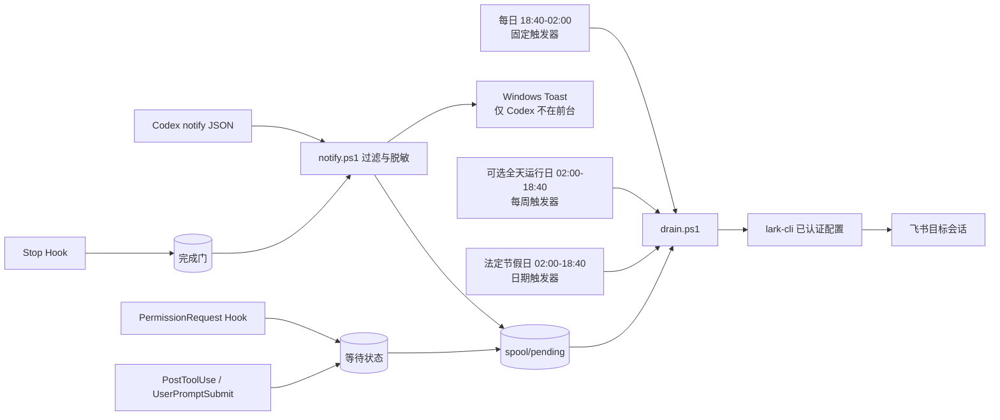

# Codex Feishu Notify for Windows

一个带有直观调节UI的转发器。把 Codex 的真实用户任务完成事件可靠地转发到飞书，同时保留 Windows 端自己的通知模式。


这是一个非官方社区项目，与 OpenAI、飞书或 Lark 均无隶属关系。当前版本仅支持 Windows 与已认证的 `lark-cli` 配置。

## 解决什么问题

- 只接收 `agent-turn-complete`，过滤标题生成、活动摘要等内部回合。
- 可只通知 Codex 桌面中可见的任务，避免无关后台通知进入飞书。
- 飞书通知采用“始终”语义，不跟随 PC 的“仅 Codex 不在前台时通知”。
- 运行计划与飞书投递设为两个独立手动开关：停用计划不改飞书配置，关闭飞书也不关闭 PC 通知。
- PC 端使用隐藏的 Windows Toast；默认只在 Codex 不处于前台时显示，不弹出命令行窗口。
- 使用官方 `SessionStart`、`PermissionRequest`、`PostToolUse`、`UserPromptSubmit` 和 `Stop` 生命周期 Hook：等待授权可提醒并在恢复后撤销，新会话的完成通知须经过两阶段门。
- 通知钩子只进行本地原子入队，不直接联网，也绝不启动计划任务。
- 计划任务是真正的每日触发器，默认仅在 18:40 至次日 02:00 每分钟排空队列。
- 法定节假日自动补齐 02:00 至 18:40 的缺口；还可任选周一至周日作为固定“全天运行日”，未选择的普通周末不自动放宽。
- 通过事件哈希、已发送标记和 `lark-cli` 幂等键降低重复发送风险。
- 默认发送飞书卡片，并检查进程退出码与结构化返回码；瞬时失败会做有限重试。
- 日志和预览会脱敏；机器配置、队列、日志和备份默认不进入 Git。

OpenAI 官方配置参考说明，用户级 `~/.codex/config.toml` 的 `notify` 是一个字符串数组命令，并会收到 Codex 传入的 JSON 载荷；项目级配置不能覆盖该通知项：[Configuration Reference](https://developers.openai.com/codex/config-reference/)。生命周期事件及输入/输出边界见 [Hooks guide](https://developers.openai.com/codex/hooks)。

## 工作方式



`notify.ps1` 在时间窗外仍可入队；普通日的队列项会等到下一次计划投递。日历中的法定节假日由日期触发器补齐日间缺口；用户勾选的固定星期由每周触发器补齐同一缺口，因此这些日期全天每分钟检查队列。超过 `max_queue_age_hours` 的项目会进入 `spool/expired`，不会继续发送。

安装前已经打开的 Codex 会话没有 `SessionStart` 就绪标记，会暂时沿用原完成通知；重新开启 Codex 后，新会话自动进入严格两阶段完成门。

## 前置条件

- Windows 10/11。
- Codex 支持用户级 `notify` 与生命周期 Hooks；新安装后需重新开启 Codex 才能完整加载 Hook。
- PowerShell 7 优先；缺失时安装器回退到 Windows PowerShell。
- `lark-cli` 已安装，并准备好可代表机器人发送消息的本地配置。（可以参考别人的项目https://github.com/zarazhangrui/lark-coding-agent-bridge/blob/main/README.zh.md）
- 已知目标会话 ID，例如 `oc_xxx`。不要把真实 ID 提交到 Git。

当前实现已按本机 `lark-cli 1.0.76` 的 `im +messages-send` 命令验证。其他版本应先运行诊断和 dry run。

## 快速安装

在 PowerShell 中执行：

```powershell
git clone https://github.com/YOUR_NAME/codex-feishu-notify-windows.git
Set-Location .\codex-feishu-notify-windows

pwsh -File .\tests\Test-Project.ps1

pwsh -File .\scripts\Install.ps1 `
  -ChatId 'oc_REPLACE_WITH_YOURS' `
  -LarkChannelProfile 'codex' `
  -ScheduleStart '18:40' `
  -ScheduleEnd '02:00' `
  -HolidayRegion 'Auto'

pwsh -File .\scripts\Test-Configuration.ps1
```

安装器会：

1. 复制运行文件到 `%USERPROFILE%\.codex\integrations\codex-feishu-notify`；
2. 在该目录写入被 Git 忽略的 `settings.local.json`；
3. 备份并安全更新用户级 `.codex\config.toml`；
4. 合并并备份用户级 `.codex\hooks.json`，保留其中不属于本项目的 Hook；
5. 尝试保留或串联已有 `notify` 命令，并保存升级前运行文件快照；
6. 注册隐藏的 `Codex.FeishuNotify`：一个每日时间窗触发器、可选的每周全天运行触发器，以及未来法定节假日的日期触发器；
7. 禁止按需启动，并且安装时不会手动启动任务。

`-HolidayRegion Auto` 根据 Windows“国家或地区”自动选择：新加坡使用 `SG`，中国使用 `CN`，无法识别时关闭节假日扩展。也可明确指定：

```powershell
# 新加坡法定节假日；项目内置 2026-2027 日历
pwsh -File .\scripts\Install.ps1 -ChatId 'oc_REPLACE_WITH_YOURS' -HolidayRegion SG

# 中国法定节假日；项目内置 2026 日历
pwsh -File .\scripts\Install.ps1 -ChatId 'oc_REPLACE_WITH_YOURS' -HolidayRegion CN

# 不启用节假日全天运行
pwsh -File .\scripts\Install.ps1 -ChatId 'oc_REPLACE_WITH_YOURS' -HolidayRegion None

# 使用自行审核的本地日历
pwsh -File .\scripts\Install.ps1 -ChatId 'oc_REPLACE_WITH_YOURS' `
  -HolidayCalendarPath '.\my-holidays.json'

# 每周六、周日全天运行；可与任一节假日模式叠加
pwsh -File .\scripts\Install.ps1 -ChatId 'oc_REPLACE_WITH_YOURS' `
  -HolidayRegion SG -AllDayWeekdays Saturday,Sunday
```

新加坡日历依据人力部公布的 [2026 年公共假日](https://www.mom.gov.sg/newsroom/press-releases/2025/0616-public-holidays-for-2026) 和 [2027 年公共假日](https://www.mom.gov.sg/newsroom/press-releases/2026/0618-public-holidays-for-2027)，包括依法顺延的周一假日。中国日历依据 [国务院办公厅 2026 年放假安排](https://www.gov.cn/zhengce/zhengceku/202511/content_7047091.htm)。周六、周日只有在日历中明确列为放假日，或通过 `-AllDayWeekdays` 明确选中时才全天运行。

如果当前 `notify` 是多行或不能安全解析，安装器会停止，不会静默覆盖。确认备份后，才可选择 `-ReplaceUnparseableNotify`。

## 图形设置器

Windows 上可直接双击项目根目录的 `Open-Settings.cmd`，也可以在 PowerShell 中运行：

```powershell
powershell.exe -NoLogo -NoProfile -STA -ExecutionPolicy Bypass `
  -File .\scripts\Settings-Gui.ps1
```

设置器会优先识别现有的 `Codex.LarkNotify.codex`，其次识别兼容的 `Codex.FeishuNotify`，并从计划任务动作自动确定安装目录；全新电脑上未找到任何兼容任务时，“安装通知”默认创建 `Codex.LarkNotify.codex`。它支持：

- 使用单一“运行计划：已开启/已关闭”开关立即启停并保存计划任务状态；使用单一“飞书通知：已开启/已关闭”开关立即保存通知状态；
- 使用动态“马上开始 / 立刻停止”按钮临时覆盖当前时段：非运行时段可立即运行到正常时段接管，运行中可暂停到下个运行时段；长期计划不会被改写；
- 显示当前配置的完整读取路径；`lark-cli` 路径留空时显示自动查找提示和当前机器实际解析到的程序路径；
- 从配置根目录自动枚举已有 Lark profile；“使用独立 Lark profile（推荐）”取消后会禁用该下拉列表并改用 `lark-cli` 默认认证；
- 在独立的“运行计划”页调整每日开始时间、结束时间、检查间隔和队列保留时间；
- 选择新加坡、中国、关闭、自动识别或自定义节假日日历，并查看当前模式的实际运行说明；
- 从周一至周日中任选固定“全天运行日”，与节假日日历叠加；
- 调整“仅通知已登记在 Codex 桌面端的任务（推荐）”、飞书桥接回声过滤和任务/结果摘要；
- 调整严格完成门、等待授权通知、飞书卡片/文本格式、发送重试与 PC 通知规则；
- 关闭 PC 通知总开关时，自动禁用其前台条件、任务完成和等待授权子选项，并保留原勾选值；
- 检查配置、查看任务状态、打开日志，以及启用或停用任务；
- 查看生命周期 Hook、等待状态和完成门计数，并可在“飞书连接”页底部使用“安装通知”首次部署或修复当前用户的通知集成，或执行受保护的“卸载通知”；
- 使用“飞书连接 / 运行计划 / 通知规则 / 状态与检查结果”分页；窗口可缩放，较小屏幕或高 DPI 下内容自动滚动，底部操作区保持可访问；
- 从旧版 `drain.ps1` 导入已有私有参数，首次应用时迁移为受管的 `settings.local.json`。

启动设置器本身只读取配置。点击“应用设置”或维护区的“安装通知”后会先显示确认信息，再复用同一安装器：备份现有配置，部署或修复通知脚本，合并用户级 Hook，修复 `notify` 命令链并重新注册任务，随后运行配置检查。“安装通知”适用于新电脑、其他 Windows 用户的 Codex 和配置被更新覆盖后的修复；它不会自动信任 Hook，完成后仍需重新打开 Codex，并在 Hook 管理界面审查、信任和启用新安装或已变化的 Hook。“运行计划：已开启/已关闭”是唯一的长期计划状态控件，切换后立即调用任务启用/停用并持久保存；时间窗等参数仍由“应用设置”提交。“马上开始 / 立刻停止”只写入带到期时间的临时覆盖状态，不调用 `Start-ScheduledTask`：开始时直接隐藏执行一次 `drain.ps1`，并在需要时增加一条到下个正常时段即失效的临时触发器；停止时让后续触发安全退出。应用设置、安装通知、卸载通知或关闭运行计划都会清除临时覆盖。飞书的立即开关仅修改本地投递配置。关闭飞书后，PC 通知继续工作，新事件不进入飞书队列，已有待发项移入可恢复的 `spool/suppressed`，再次打开时不会自动补发。飞书会话 ID 默认遮挡，检查输出不会打印该值。

命令行安装时也可预设关闭状态：`-DisableScheduledTask` 停用运行计划，`-NoFeishuNotifications` 关闭飞书投递。两个参数都不会按需运行计划任务。

维护者可使用只读模式验证自动识别和输入模型，不打开窗口：

```powershell
pwsh -NoProfile -File .\scripts\Settings-Gui.ps1 -ValidateOnly
```

## 重要配置

安装后的私有配置位于：

```text
%USERPROFILE%\.codex\integrations\codex-feishu-notify\settings.local.json
```

主要字段：

| 字段 | 默认值 | 含义 |
|---|---:|---|
| `transport.enabled` | `true` | 飞书通知总开关；关闭时不影响 PC 通知 |
| `transport.chat_id` | 必填 | 飞书目标会话 ID，不提交 Git |
| `transport.cli_path` | 空 | 留空时自动查找 `lark-cli` |
| `transport.channel_home` | `%USERPROFILE%\.lark-channel` | 本地 Lark channel 配置根目录 |
| `transport.profile` | `codex` | 专用配置名 |
| `transport.send_attempts_per_run` | `2` | 每次计划排空中的有限发送尝试次数 |
| `transport.retry_delay_seconds` | `2` | 同一轮尝试之间的等待秒数 |
| `filters.visible_threads_only` | `true` | 只保留桌面可见任务；不兼容时可关闭 |
| `filters.skip_bridge_origin` | `true` | 跳过由飞书桥接发起的回合，避免回声 |
| `delivery.start` / `end` | `18:40` / `02:00` | 每日跨午夜运行窗 |
| `delivery.interval_minutes` | `1` | 窗口内排队检查间隔 |
| `delivery.holiday_region` | `SG` | `SG`、`CN` 或 `None`；安装时 `Auto` 会解析为具体值 |
| `delivery.holiday_calendar` | `holidays.local.json` | 安装器复制的私有运行日历 |
| `delivery.all_day_weekdays` | `[]` | 可选 `Monday` 至 `Sunday`；选中的星期补齐为全天运行 |
| `delivery.max_queue_age_hours` | `24` | 过期队列项不再发送 |
| `lifecycle.strict_completion_gate` | `true` | `Stop` 先登记，同一任务的官方完成事件才能入队 |
| `lifecycle.notify_permission_requests` | `true` | 接收真正的权限等待事件 |
| `desktop.only_when_codex_background` | `true` | 仅控制 PC Toast；不影响飞书发送 |
| `message.format` | `card` | `card` 或 `text` |
| `message.include_*_preview` | `true` | 是否发送任务和结果摘要；敏感场景建议关闭 |
| `message.include_permission_tool` | `false` | 默认不把等待授权的工具名发到飞书 |

修改时间窗、节假日日历或全天运行日后应重新运行安装器，使计划任务与配置同步，不能只改 JSON。官方下一年度日历发布后也应更新日历并重新安装；安装器只为日历中尚未过去的日期创建触发器。

安装时可用 `-AllThreads` 关闭“仅桌面可见任务”过滤，用 `-IncludeBridgeOrigin` 保留飞书来源回合，用 `-NoTaskPreview` / `-NoResultPreview` 关闭相应预览；这些都是显式开关，适合直接通过 `pwsh -File` 使用。

## 验证与排错

只读诊断：

```powershell
pwsh -File .\scripts\Test-Configuration.ps1
```

查看最近的脱敏日志：

```powershell
Get-Content "$env:USERPROFILE\.codex\integrations\codex-feishu-notify\logs\notify.jsonl" -Tail 30
```

直接测试排空逻辑但不真正发消息：

```powershell
pwsh -File "$env:USERPROFILE\.codex\integrations\codex-feishu-notify\drain.ps1" -DryRun
```

dry run 不会生成已发送标记，也不会删除待发项。计划任务禁止按需启动；测试脚本直接运行 `drain.ps1`，不调用 `Start-ScheduledTask`。

## 卸载

先恢复 Codex 通知钩子并移除计划任务，保留队列和日志：

```powershell
pwsh -File .\scripts\Uninstall.ps1
```

确认不再需要本地设置、日志和队列后，再永久删除安装目录：

```powershell
pwsh -File .\scripts\Uninstall.ps1 -RemoveData
```

卸载器只会在当前 `notify` 行仍与安装记录一致时自动恢复原值；生命周期 Hook 只删除本项目拥有的处理器，其他 Hook 保留。若用户之后改过配置，它会保留现状并要求人工检查。图形设置器“飞书连接”页底部的“卸载通知”会恢复安装前计划任务，并保留设置、日志和队列。

## 隐私与安全

- 不要提交 `settings.local.json`、`.lark-channel`、日志、队列、备份或真实会话 ID。
- 任务和结果预览可能包含业务内容。敏感环境可把两个 `include_*_preview` 均设为 `false`。
- 事件载荷字段和桌面全局状态的可见任务标记并非本项目控制；Codex 更新后应重新跑测试。
- 生命周期 Hook 从不返回批准、拒绝或自动继续决定；飞书远程审批和终端输入不属于本通知器的权限边界。
- 运行第三方 fork 的安装脚本前，应先检查 PowerShell diff。

详见 [SECURITY.md](SECURITY.md)。

## 项目结构

```text
src/                         运行时脚本与公共模块
scripts/                     安装、卸载、只读诊断
config/                       无真实标识的配置样例及官方节假日日历
tests/Test-Project.ps1       语法、调度、过滤与泄密检查
.github/                     CI、Issue 和 PR 模板
docs/                        架构、迁移与 GitHub 发布攻略
```

## 文档

- [架构与边界](docs/architecture.md)
- [节假日日历维护](docs/holiday-calendars.md)
- [从现有本机版本迁移](docs/migration-from-local.md)
- [飞书远程审批与终端输入评估](docs/remote-control-evaluation.md)
- [递交 GitHub 的完整攻略](docs/github-publish-guide.md)
- [第三方设计参考与许可证](THIRD_PARTY_NOTICES.md)

## 许可证

[MIT](LICENSE)
